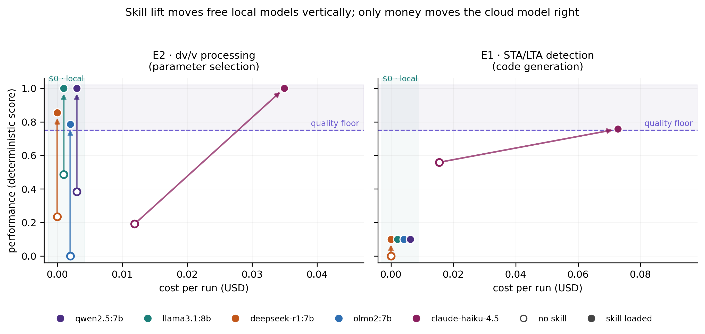

## Abstract

Artificial-intelligence agents are entering scientific workflows faster than our
ability to check them, and the evidence offered is usually a demonstration. The
decision a laboratory actually faces is not whether a model is impressive, but
which is the cheapest configuration that clears its scientific quality floor —
and whether that configuration may lawfully touch its data. We argue that
evaluation for science must therefore be cost-aware and scaffolding-aware, and
present FrugalMind, a framework built on four commitments: cost as a first-class
axis against explicit quality floors; a scorability spectrum that pushes every
task toward deterministic verification and admits a model judge only as a last
resort; negative-case discipline, so that confident fabrication is penalised
rather than invisible; and skill-conditioned evaluation, in which the unit of
measurement is the deployed model–scaffolding pair and the score change
attributable to domain guidance, the skill lift, is reported in its own right.
Running the framework live on geoscience tasks across four locally executed
open-weight models and one cloud model, we find that whether scaffolding
substitutes for scale depends on the kind of task: on parameter selection, a
domain skill lifts free local models to the score of a paid frontier model at
zero marginal cost, whereas on code generation no skill rescues them. We further
show that a simulated evaluation harness reported a confident score on a task
that live models cannot perform at all, and argue that benchmarks must be
validated against live systems before they are trusted.

## Main

The question a research group must answer before adopting an AI agent is narrow
and practical: *given this task, this budget and this data-governance constraint,
what is the cheapest system that produces science I am willing to sign my name
to?* Existing benchmarks answer a different question. They rank models by
capability on tasks selected for discriminative power, report accuracy, and treat
cost — when they report it at all — as an appendix[@liang2023helm;
@jimenez2024swebench; @mialon2024gaia]. This is appropriate for tracking frontier
progress and close to useless for the adoption decision, for three reasons.

First, **cost is not a footnote; it is half the decision**. A group that cannot
spend a frontier-model call on every step of a workflow needs to know where a
cheap model suffices. A leaderboard on which every entry clears the bar cannot
tell it, because the cost axis is decoration when nothing fails. This has an
uncomfortable corollary that we adopt deliberately: a useful benchmark must
contain systems that are *not good enough*.

Second, **the unit of deployment is not a model**. Laboratories do not deploy
models; they deploy models together with scaffolding — a system prompt, a domain
skill, a tool harness, an agent loop. Benchmarks that hold scaffolding fixed
measure something nobody ships. The actionable quantity is how far a given piece
of scaffolding *moves* a given model, and whether that movement is enough to
substitute for a more expensive one.

Third, **much scientific data cannot leave the building**. Embargoed catalogues,
pre-publication observations and collaborator data under agreement mean that, for
a large class of real work, closed application-programming-interface (API) models
are the ones a group is *not permitted* to use. A benchmark that measures only
API models is silent about the tools a laboratory may actually run.

We present FrugalMind, an evaluation framework constructed from these three
observations, and instantiate it on geoscience tasks. The framework's commitments
are stated in Methods; its consequences are the subject of this paper. Running it
live — with real prompts, real domain skills, model-generated code executed in a
sandbox, deterministic scoring and costs taken from realised token usage — yields
a decision rule we did not anticipate: **whether scaffolding substitutes for scale
depends on the kind of task.** On a parameter-selection task, free locally
executed 7–8-billion-parameter (7–8B) models reach the score of a paid frontier
model once a domain skill is supplied, at zero marginal cost. On a
code-generation task, the same models fail regardless of scaffolding, and only
the cloud model produces working code. We also report a methodological result of
independent interest: our own *simulated* harness reported a confident, internally
consistent score on a task that live models score zero on, because the task was
ill-posed.

## Results

### A framework organised around the adoption decision

FrugalMind evaluates *(model, scaffolding)* configurations against a **quality
floor** — the score below which an output is not scientifically usable — and
reports, jointly, the score and the realised cost. The recommended system is the
cheapest configuration clearing the floor, not the highest scorer. Locally
executed open-weight models are recorded at zero marginal cost, which is not an
accounting convenience but the economics of running a model on hardware a
laboratory already owns.

Three further commitments make the resulting numbers trustworthy, and are
detailed in Methods. The **scorability spectrum** orders scorer types by
verifiability — from deterministic reference matching, through numerical
tolerance and perceptual comparison, to trajectory agreement and finally a
model-based judge — and imposes a construction rule: push every task as far
toward deterministic verification as it will go, admitting a judge only where no
stronger check can be expressed. **Negative-case discipline** requires that every
evaluation contain instances in which the correct answer is explicitly *nothing*,
so that confident fabrication is a scored failure rather than an invisible one.
And **skill-conditioned evaluation** makes the unit of measurement the deployed
pair rather than the model: each task is run with the domain skill withheld and
supplied, and we define the **skill lift** as the difference in score
attributable to the guidance alone.

We organise scientific evaluations into three families — document-based (reading
and reasoning over the literature), software-agent (driving real scientific
software), and research-workflow (orchestrating sub-agents, scored on the
trajectory of calls rather than the answer). The evaluations reported here are
drawn from the software-agent family; the other two are specified and supported
by the substrate but are not yet populated with mature evaluations, a limitation
we return to in the Discussion.

### Scaffolding substitutes for scale on parameter selection

In evaluation E2, an agent must choose the six coupled parameters of an
ambient-noise relative-velocity-change (dv/v) pipeline for a stated monitoring
target — estimator, frequency band, coda lapse-time window, stack length,
reference strategy and coherence gate. The proposed configuration is executed on
a hidden synthetic record and scored on its recovery of the known velocity change
(Methods).

All five models improve substantially when the domain skill is supplied
(Table 1). Two freely available, locally executed models — `qwen2.5:7b` and
`llama3.1:8b` — reach a **perfect score of 1.00 with the skill, equalling the
paid cloud model `claude-haiku-4.5` at zero marginal cost.** The skill lift is
large for every model (+0.51 to +0.81), and the weakest model gains the most
(`olmo2:7b`, 0.00 → 0.79). On this task the frugal configuration is not a
compromise but an equivalent: paying for a frontier model buys nothing.

### Scaffolding does not substitute for scale on code generation

In evaluation E1, an agent must *write* a short-term-average / long-term-average
(STA/LTA) seismic-event detector[@allen1978automatic]; its code is executed in a
sandbox and the trigger onsets it reports are scored against reference onsets
(Methods).

Every 7–8B model fails, with or without the skill (Table 2). Their score of 0.10
is diagnostic rather than merely low: under our staged scorer it corresponds
exactly to *"produced a code block that never executed successfully and never
reported a result"*. Inspection of the generated code reveals a consistent
failure mode — the models **import the correct library functions and then decline
to use them**, hand-rolling a windowed-average loop that terminates in an
out-of-bounds error:

```python
from obspy.signal.trigger import classic_sta_lta, trigger_onset   # imported…
…
for i in range(len(waveform) - sta_samples):                      # …then ignored
    lta_trace[i + lta_samples // 2] = np.mean(waveform[i:i + lta_samples])
# IndexError: index 1001 is out of bounds for axis 0 with size 1001
```

The skill explicitly instructs them to use the library routine. They do not
comply.

The cloud model's behaviour is instructive in the other direction. Without the
skill it scores 0.56 — **precisely the score of a canonical reference
implementation (0.559)**: it writes the textbook detector, which re-triggers on
the seismic coda and therefore reports one true onset together with several
artefacts, collapsing precision. Supplied with the skill, which teaches coda
declustering, it reaches 0.76. It acts on the guidance; the smaller models,
given the same guidance, cannot.

### A task-dependent decision rule

Taken together (Fig. 1), the two evaluations yield a rule that is directly
actionable for a laboratory:

> Where the task is **selection among domain choices**, a well-authored skill
> lifts a free local model to the score of a frontier model, and paying for the
> frontier model buys nothing. Where the task requires **writing correct
> numerical code**, no skill rescues a model that cannot write it, and the
> frontier model is not optional.

The geometry of Fig. 1 carries the claim: because local inference has zero
marginal cost, a skill moves a local model *vertically* — score is bought at no
price — whereas the cloud model's improvement is purchased with money, moving it
to the right. Three of four free models cross the quality floor on parameter
selection; none approaches it on code generation.

### Simulated harnesses report confident scores on ill-posed tasks

Before running live models we populated the leaderboard using a *simulated*
harness — deterministic per-model competence profiles emitting canned answers —
in order to exercise the pipeline without a graphics processing unit. It reported
a plausible and internally consistent improvement, from 0.36 to 0.82, on the
detection evaluation.

Live models scored **0.00 on every item.** The task, as originally written,
pasted approximately one thousand raw waveform samples into the prompt and asked
the model to execute a signal-processing algorithm mentally. A 7B model replied,
not unreasonably: *"It looks like you've provided a list of numerical values.
Could you please clarify what you would like to do with this data?"* The task was
not difficult; it was **ill-posed**, and no language model can perform it. We
reshaped it into the code-generation evaluation reported above.

We report this because we suspect it is not rare. Simulated or mocked harnesses
are common during benchmark development, and they are structurally incapable of
detecting an ill-posed task: they invent responses to prompts that no real model
would engage with. **A benchmark that has never been run against a live system
should not be trusted, including by its authors.**

## Discussion

The three observations that motivate FrugalMind — that cost is half the adoption
decision, that laboratories deploy scaffolded systems rather than models, and
that much scientific data may not leave the institution — are not specific to the
geosciences, and neither, we expect, is the decision rule they produce. The
distinction our results draw is between tasks that require the model to *select*
among domain alternatives and tasks that require it to *construct* a correct
artefact. Selection appears to be the regime in which human domain knowledge,
encoded once as a versioned skill, transfers efficiently into a small model.
Construction is not: the failure we observe is not a deficit of domain knowledge
that guidance can repair, but an inability to write code that runs.

This suggests where scaffolding research has headroom. The small models failed
having been given a single attempt and no sight of their own errors. An agent
loop that returns the interpreter traceback and permits revision attacks exactly
the observed failure mode, and would test whether *tool* scaffolding rescues what
*skill* scaffolding could not. We identify this as the most informative next
experiment, and note that its outcome would sharpen rather than overturn the rule
reported here: it would locate the boundary, not erase it.

Our findings also bear on how benchmarks should be built. The scorability
spectrum is a discipline rather than a taxonomy, and applying it changes how
tasks are *written*: a literature task that appears irreducibly judgemental
frequently decomposes into a deterministic retrieval component, a deterministic
grounding component, and a small genuinely subjective residue. Shrinking the
judged surface shrinks the noise, and with it the temptation to accept a
plausible number in place of a verified one — a temptation to which, as we
document above, we ourselves initially succumbed.

Several limitations bound these conclusions, and we state them plainly. The
evaluation suite is deliberately small: two evaluations, both drawn from one of
the three proposed families and both from seismology, with 11 and 20 items
respectively, five models, and a single deterministic run per configuration. The
qualitative separation between the two regimes is large and mechanistically
explained, but individual scores carry uncertainty that we do not quantify.
Skill lift is a property of the model–skill pair, and differently authored
guidance would produce different lifts; we claim that lift is the right quantity
to measure, not that our particular skills are optimal. The 7–8B failure on code
generation is a floor rather than a ceiling, for the reason given above. Finally,
our cost accounting is marginal token cost, and excludes electricity, hardware
amortisation and the substantial wall-clock cost of local inference, which a
laboratory does feel.

<!-- TODO(marine): before submission, this Discussion must also address:
     (i) results from at least one document-based or research-workflow eval, so
         the three-family taxonomy is demonstrated rather than merely proposed;
     (ii) repeated runs with confidence intervals;
     (iii) an explicit comparison against AstaBench / SWE-bench / GAIA rather
         than the assertion currently made in the Main text.
     A Nature Article will not survive review without (i) and (ii). -->

## Methods

### Quality floors and frugality

Each task carries a quality floor: the score below which an output is not
scientifically usable. The floor is a property of the task and the discipline,
set by what a reviewer would accept, and not of the model. For each *(model,
scaffolding)* configuration we report the deterministic score and the realised
cost in United States dollars, computed from token usage returned by the serving
backend. Models executed locally through Ollama are assigned zero marginal cost.

### The scorability spectrum

We order scorer types by verifiability: **T0**, deterministic matching of an
exact or structured value with tolerance; **T1**, numerical agreement with a
reference array or scalar; **T2**, perceptual comparison against a reference
artefact; **T3**, agreement of a realised process or call graph with a reference
trajectory; **T4**, a rubric applied by a model judge. The construction rule is
to express every task at the strongest tier it admits, and to use T4 only where
no lower tier can encode the check — in which case the judge's disagreement with
the deterministic score is itself reported. Both evaluations in this paper are
scored at T1.

### Negative-case discipline

Every evaluation must contain instances for which the correct answer is
explicitly nothing. Three of the eleven detection cases in E1 are noise-only; a
model reporting an event in them is penalised exactly as one that misses a real
event. This makes confident fabrication — the failure mode a scientist most needs
a benchmark to catch — a scored outcome rather than an invisible one.

### Skill-conditioned evaluation and skill lift

A **skill** is versioned, human-authored domain guidance attached to a task: not
a prompt heuristic, but what a senior colleague would tell a new student before
they touched the data. Each skill carries a name, a semantic version and a change
history, and every score records the exact skill version that produced it. Each
evaluation is executed under two injection modes, `none` (no skill) and `full`
(skill supplied), and we define the skill lift as
$\mathrm{lift} = \mathrm{score}(\text{model},\text{skill}) - \mathrm{score}(\text{model},\text{none})$.
Two skills are used here: `stalta-detection` (v0.3), which teaches, among other
things, that STA/LTA re-triggers on the coda and that onsets must therefore be
declustered; and `dvv-processing` (v0.1), which teaches that the measurement band
follows the depth of the target and the coda window follows the band.

### Contamination control

A benchmark whose answers are public measures memorisation. For *generated*
benchmarks the obvious remedy is fragile: if the generator and its parameters are
published, withholding the generated file protects nothing, because anyone can
reproduce it. We therefore locate the secret in the **generator seed** rather
than in the data. The generator is public and auditable; the public `validation`
split ships with the software so that the demonstration is reproducible on a
laptop. The `test` split, from which any ranked score is computed, is synthesised
from a secret master seed that determines every instance parameter — event delay,
amplitude, noise level, inter-event separation — and is stored with the gated
dataset and never committed to version control. Without the seed the hidden
answers cannot be reconstructed, even by an adversary holding the generator and
the underlying public recording. The benchmark is therefore simultaneously fully
auditable and genuinely hidden.

### Evaluation suite

**E1, STA/LTA detection (code generation).** Cases are synthesised from a real
recording of the 2019 *M*7.1 Ridgecrest earthquake (FDSN SCEDC, station CI.MWC,
vertical component) by seeded transforms: amplitude scaling, additive noise, time
shifts and the injection of a second event. The agent is given the sampling rate
and detector parameters and must write Python that computes trigger onsets and
reports them; the code is executed in the sandbox with the waveform injected as a
variable, and the reported onsets are scored by F1 against the reference onsets
with a 1.5-second matching tolerance. The public split comprises 11 cases: 8
positive and 3 noise-only negatives. Scoring is staged: 0.1 for producing
extractable code, 0.1 for code that executes and reports a result, and 0.8
proportional to the F1 of the reported onsets.

**E2, dv/v processing (parameter selection).** The agent is given a monitoring
setting (volcanic edifice, fault zone, landslide body, aquifer, cryosphere or
geothermal reservoir) and must return the six pipeline parameters as structured
output. Scoring is performed by `codameter` (v0.2.1), which executes the proposed
configuration on a hidden synthetic record with a known imposed velocity change
and grades its recovery. The validation split comprises 20 cases.

### Models and live protocol

Four open-weight models were executed locally through Ollama on a laptop
(`qwen2.5:7b`, `llama3.1:8b`, `deepseek-r1:7b`, `olmo2:7b`), and one cloud model
(`claude-haiku-4.5`) through its API. All inference was live: real prompts, real
skill injection, model-generated code executed in a pinned sandbox, deterministic
scoring, and costs from realised token usage. The complete run comprised 410
inference calls with no harness errors and a total cloud expenditure of
US$0.135.

### Reproducibility and statistics

Scoring is fully deterministic given a model response, so the only stochasticity
is the model's sampling. Each configuration was run once; we therefore report
point estimates without confidence intervals, and the individual scores should be
read accordingly. <!-- TODO(marine): replace with n>=5 repeats and 95% CIs before
submission. Local models cost $0 to re-run; there is no excuse for omitting this
and a reviewer will demand it. -->

Every quantity that affects a score — the truth set, the skill, the scorer
specification, the model identifier and the sandbox image — is recorded on the
row that carries the score. Scoring itself is expressed as a serialisable
specification rather than as code, so that a benchmark row can be scored by a
third party, or by a server holding hidden answers, without executing the
author's software.

## Figures

{width=100%}

**Fig. 1 | Skill lift moves free local models vertically; only money moves the
cloud model right.** Cost-versus-performance plane for the two evaluations. Each
model contributes two points per evaluation: without the domain skill (hollow
marker) and with it (filled marker), joined by an arrow whose length and
direction represent the skill lift. Locally executed models have zero marginal
cost and are therefore spread across an explicitly labelled `$0 · local` lane so
that their arrows do not occlude one another; the horizontal offsets within that
lane are a drawing device and do not denote cost. The dashed line marks an
illustrative quality floor. **Left**, parameter selection (E2): three of four
free models cross the floor once the skill is supplied, and two attain the same
perfect score as the paid cloud model. **Right**, code generation (E1): no free
model approaches the floor with or without the skill; only the cloud model
reaches it, at a cost of US$0.073 per run.

## Tables

**Table 1 | Parameter selection (E2, dv/v processing).** Deterministic score
without and with the domain skill, the resulting skill lift, and the realised
cost of the skilled configuration. *n* = 20 items.

| Model | Weights | Score (no skill) | Score (skill) | Lift | Cost (US$) |
|---|---|---|---|---|---|
| claude-haiku-4.5 | closed, API | 0.19 | **1.00** | +0.81 | 0.0350 |
| qwen2.5:7b | open | 0.38 | **1.00** | +0.62 | **0.0000** |
| llama3.1:8b | open | 0.49 | **1.00** | +0.51 | **0.0000** |
| deepseek-r1:7b | open | 0.23 | 0.85 | +0.62 | **0.0000** |
| olmo2:7b | open | 0.00 | 0.79 | +0.79 | **0.0000** |

**Table 2 | Code generation (E1, STA/LTA detection).** As Table 1. *n* = 11 items
(8 positive, 3 noise-only negatives). A score of 0.10 corresponds to producing
code that never executed successfully.

| Model | Weights | Score (no skill) | Score (skill) | Lift | Cost (US$) |
|---|---|---|---|---|---|
| claude-haiku-4.5 | closed, API | 0.56 | **0.76** | +0.20 | 0.0728 |
| qwen2.5:7b | open | 0.10 | 0.10 | 0.00 | **0.0000** |
| llama3.1:8b | open | 0.10 | 0.10 | 0.00 | **0.0000** |
| olmo2:7b | open | 0.10 | 0.10 | 0.00 | **0.0000** |
| deepseek-r1:7b | open | 0.00 | 0.10 | +0.10 | **0.0000** |
